## Image Segmentation by K-Means

#### 实验目的

1. 掌握图像分割的基本思想，了解其分割技术及其计算策略；
2. 学会从图像处理到分析的关键步骤，掌握图像分割过程； 
3. 了解图像分割的意义，进一步加深对图像分析和理解； 
4. 掌握基本分割方法：K-means图像分割，并编程实现。

 </br>

#### 实验原理

图像分割就是指把图像分成互不重叠的区域并提取出感兴趣目标的技术和过程。

1.  K-Means聚类算法基本思想   

K-Means算法的基本思想是初始随机给定K个簇中心，按照最邻近原则把待分类样本点分到各个簇。然后按平均法重新计算各个簇的质心，从而确定新的簇心。一直迭代，直到簇心的移动距离小于某个给定的值。

2.  两种典型的聚类方法:

K均值(K-means)聚类:像素特征符合混合高斯分布，通过估计各个高斯分布的均值和方差进行聚类;• 均值漂移(Mean Shift)聚类:直接对像素特征分布进行建模，并寻找分布模型中的局部极值点进行聚类;

3. K-Means聚类算法主要分为三个步骤：  

(1)第一步是为待聚类的点寻找聚类中心  

(2)第二步是计算每个点到聚类中心的距离，将每个点聚类到离该点最近的聚类中去

(3)第三步是计算每个聚类中所有点的坐标平均值，并将这个平均值作为新的聚类中心  

反复执行(2)、(3)，直到聚类中心不再进行大范围移动或者聚类次数达到要求为止

4.  优势劣势分析：

* K-means的优势: 

1)算法简单; 

2)能收敛到局部极值。

* K-means的不足: 

1)Memory-intensive

2)需要指定聚类中心数k; 

3)对初始值敏感; 

4)对外点敏感; 

5)只能进行“球形”聚类。

</br>

#### 实验步骤

* **Step1 Read Image**


以imread读入图像，获得该图像表示每个像素点RGB值的三维数据。

```python
image=cv2.imread("imgs/black_kitten.jpg")

plt.figure()
plt.imshow(image)
plt.title('original image')

segment_num = 3
seg = Segment(segment_num)
```


- **Step2 Extract Features  & K-Means Algorithm**  

我们编写了一个 class Segment 来实现所有需要的算法。

这里以图像的 RGB 值作为图像特征，K-Means 算法的每类中心点用随机进行初始化。

```python
from __future__ import print_function, division
import numpy as np
import matplotlib as mpl
import matplotlib.pyplot as plt
%matplotlib inline
import cv2

class Segment:
    def __init__(self,segments=5):
        # 聚类个数，这里先默认初始化为 5
        self.segments=segments

    def kmeans(self,image):
        # 先以7x7大小的窗口进行高斯平滑
        image = cv2.GaussianBlur(image,(7,7),0) 
        # 将image构成一个2维矩阵，大小为 像素个数(mxn)x3，这里3是RGB三个通道
        vectorized=image.reshape(-1,3) 
        vectorized=np.float32(vectorized) 
        # criteria 指定迭代精度和最大迭代次数
        criteria=(cv2.TERM_CRITERIA_EPS + cv2.TERM_CRITERIA_MAX_ITER, 10, 1.0)
       
    	# 调用k-Means算法：
        # Output:
   		# ret: 每一类中的所有特征点到该类中心店的距离
		# label: 图像的每个像素点聚类后的类别标签
ret,label,center=cv2.kmeans(vectorized,self.segments,None,criteria,10,cv2.KMEANS_RANDOM_CENTERS)
        res = center[label.flatten()]
        segmented_image = res.reshape((image.shape))
        return label.reshape((image.shape[0],image.shape[1])),segmented_image.astype(np.uint8)

	# 将分类后的图像进行标记
    def extractComponent(self,image,label_image,label):
        component=np.zeros(image.shape,np.uint8)
        component[label_image==label]=image[label_image==label]
        return component
```


* **Step 3 Output**


调用上述函数的情况如下，最终输出图像：

```python
label,result=seg.kmeans(image)
plt.figure()
plt.imshow(result.astype(np.uint8))
plt.title('k-means: k=' + str(segment_num))

result=seg.extractComponent(image,label,2)
plt.figure()
plt.imshow(result.astype(np.uint8))
plt.title('extract component')
```


在命令行中输入如下指令即可运行上述程序：

```python
!ls imgs
!imgcat imgs/*
```


#### 结果分析

* **初始点analysis**

在K-means算法中，初始的聚类点是随机选择的。然而不同的初始聚类点，对于迭代结果是不同的。为了验证不同初始点对于聚类结果的影响，我们通过变换初始点:

```python
imglist = []
for i in range(2):
    segment_num = 10
    seg = Segment(segment_num)

    label,result=seg.kmeans(image)
    
    imglist.append(result)
    
    plt.figure()
    plt.imshow(result.astype(np.uint8))
    plt.title('k-means: k=' + str(segment_num) + ' repetition: ' + str(i))
    
img = imglist[1] - imglist[0]
img = cv2.cvtColor(img, cv2.COLOR_BGR2GRAY)

plt.figure()
plt.imshow(img.astype(np.uint8), plt.cm.gray)
plt.title('Difference')
```


对比实验结果如下：


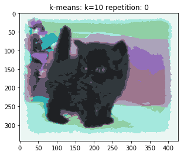


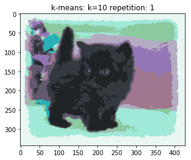


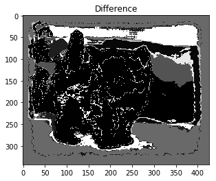


可以看出，两幅图像有一些差别，主要在背景处，不同色块的聚类面积和区域有不同。这说明K-means在局部迭代出不同的结果。


</BR>

* **不同聚类个数的选取**

K-Menas算法首先选择K个初始质心，其中K是用户指定的参数，即所期望的簇的个数。

在 K-means 算法中 K 是事先给定的，这个 K 值的选定是非常难以估计的。

很多时候，事先并不知道给定的数据集应该分成多少个类别才最合适。这也是 K-means 算法的一个不足。

在本实验中， 我们选取不同的k值进行了结果对比。

以black_kitten.jpg为例，首先固定k=3，可以看到聚类较为粗糙，如下图所示。

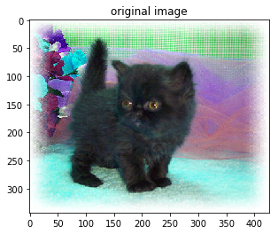


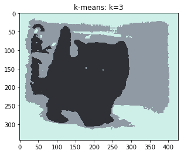


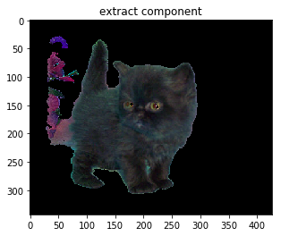

</BR>

之后我们变换步长设置k分别为2、5、10、20、50。

```python
for n in [2,5,10,20,50,]:
    segment_num = n
    seg = Segment(segment_num)

    label,result=seg.kmeans(image)
    plt.figure()
    plt.imshow(result.astype(np.uint8))
    plt.title('k-means: k=' + str(segment_num))
```
结果如下：

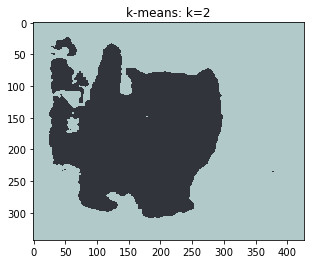


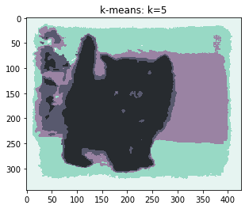


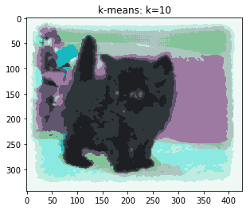


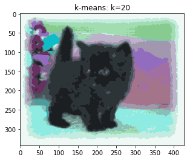


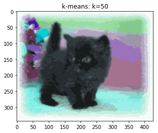


可以看出k=2时，猫的轮廓较为清晰，然而背景融为一体。随着k值的增加，背景的分割逐渐清晰，当 k值在10附近，背景与前景分割基本定型，当k值大于20时，聚类效果差别较小。这与K-means的k值所代表意义是相同的，实验结果符合预期效果。

