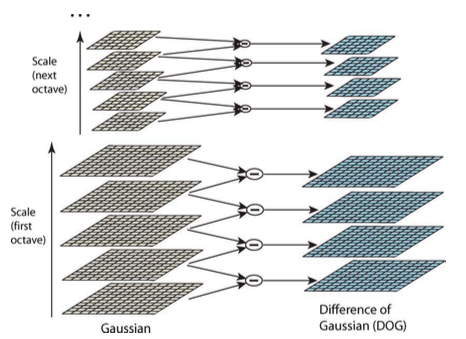
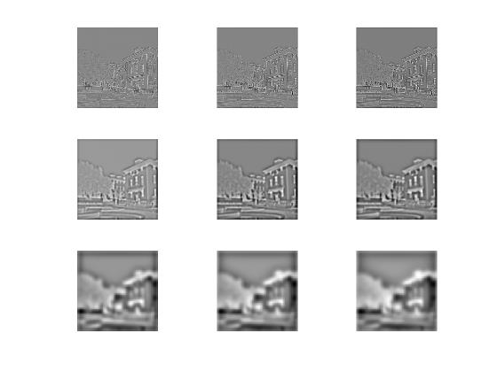
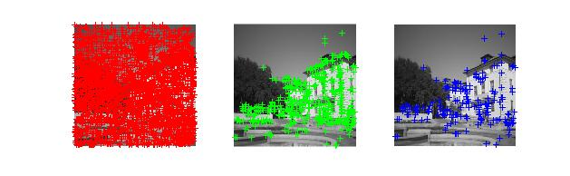
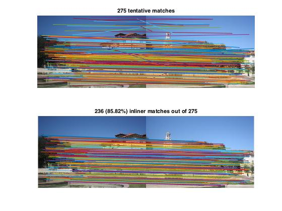
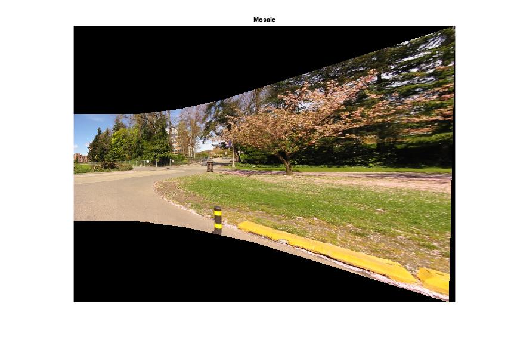
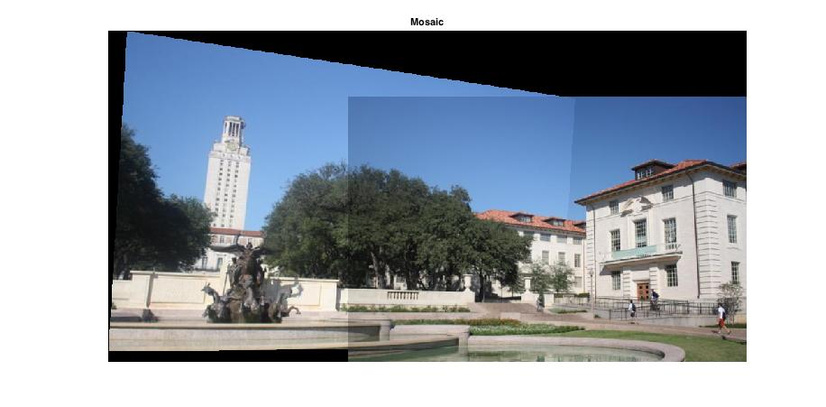
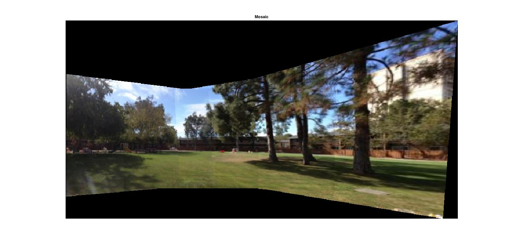
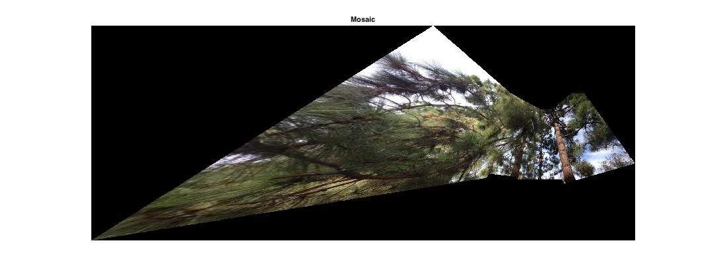
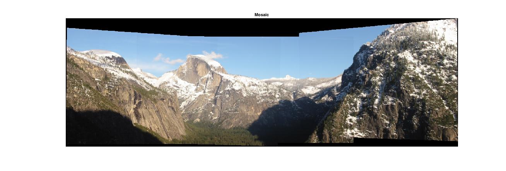

## P2  基于 SIFT 及 RANSAC 算法的全景图拼接


* **Step1  读入待融合图像，提取 SIFT 特征点**


SIFT 算法就是在空间尺度中寻找极值点，并提取出其位置、尺度、旋转不变量。

总结一下该算法的步骤就是，先用不同尺度（标准差）的高斯函数对图像进行平滑，然后比较平滑后图像的差别，差别大的像素就是特征明显的点。   

下面是 SIFT 算法前部分的 MATLAB 函数实现：

1. 首先读入图像，初始化高斯差分尺度空间（DoG scale-space）大小；初始化 octave 个数和每个 octave 的图像层数；初始化第一个 octave 里的第一幅图。

```matlab
% sift_feature_extract.m
function [feature] = sift_feature_extract(imgfile)
	row = 256;
	colum = 256;
	img = imread(imgfile);
	img = imresize(img,[row,colum]);
	img = im2double(rgb2gray(img));

	% 这里 octave 个数取 3；每个 octave 的图像层数取 3。
	sigma0 = sqrt(2);
	octave = 3; % 6*sigma*k^(octave*level)<=min(m,n)/(2^(octave-2))
	level = 3;
	D = cell(1,octave);
	 
	% 初始化高斯差分尺度空间 DoG 大小
	for i=1:octave
		D(i) = mat2cell(zeros(row*2^(2-i)+2,colum*2^(2-i)+2,level),row*2^(2-i)+2,colum*2^(2-i)+2,level);
	end
	% 第一个 octave 里的第一幅图由原始图像插值得到：
	temp_img = kron(img,ones(2));
	temp_img = padarray(temp_img,[1,1],'replicate');
```

2. 检测尺度空间的极值：

a. 首先要构建出如下尺度空间：




空间被分为多个 octave。每个 octave 的构建如下：

**左侧**：每个 octave 中有多层，每一层是不同尺度下的一个图像空间（目的是模拟图像数据的多尺度特征）。用高斯核与一个初始图像卷积得到：
$$
L(x,y,scale) = G(x,y,scale) *I(x,y)
$$
这里 G 是一个变化尺度的高斯函数（公式略），`*`  是 x 和 y 的卷积计算；scale 大小决定图像的平滑程度，其值越大，图像越粗糙；每个 octave 中有一个初始 scale，为上一个 octave 的初始 scale 的 2 倍，然后每层的尺度取值就依次为 $scale, k*scale, k^2*scale,...$ ，所以其实每层图像也就是对其前一层进行 Laplacian 变换的结果。

**右侧**：DoG 尺度空间，即是如图所示求得的左侧的差分：
$$
D(x,y,scale) = L(x,y,k*scale) - L(x,y,scale)
$$
<br>

这里我划分 3 个 octave，每个 octave 中 Gaussion 图像有 4 层 (即 s+3) ，DoG 图像有 3 层 (即 s+2) ，之后以每一个 octave 的 DoG 的中间 1 层 (即 s) 检测极值（首末两层是无法进行极值比较的）。这样一来，将第 i 个 octave 中的初始 scale 表示为$\sigma_i$，则用于检测极值的图像的 scale 值就分别为
$$
k*\sigma_1, k^2*\sigma_1,k*\sigma_2, k^2*\sigma_2,...
$$
为了使得极值检测是在一个**连续变化（等比）的尺度空间**中进行，于是有 $\sigma_{i+1} = k^2*\sigma_i$，即每一个 octave 的初始 scale，等于前一个 octave 的第 2 层图像的 scale，所以每一个 octave 的初始图像由前一个 octave 的第 2 层图像二分重采样得到（即图像大小上长宽分别减半）。这里由于用每一个 octave 的中间 1 层 DoG 检测极值，所以 k 取 2。

所以实际上 第 i 个 octave 的 第 j 层图的 scale 值为 $k^{2^{i-1}}*\sigma*k^{j-1}$。（ i = 1,2,3, j = 1,2,...5 ）


```matlab
	%% 图像金字塔
	for i=1:octave
	    temp_D = D{i}; 
	    for j=1:level
		    % 第 i 个 octave 的 第 j 层图的 scale 值
	    	scale = sigma0 * 2^(2^(i-1)+(j-1)); 
	        p = level*(i-1);
	        figure(1);
	        subplot(octave,level,p+j);

	        f = fspecial('gaussian',[1,floor(6*scale)],scale); % 尺度为 scale 的高斯函数
	        L1 = temp_img;
	        % 图像 temp_img 的尺度空间 L2，即一个变化尺度的高斯核与该图像的卷积
          	L2 = conv2(temp_img,f,'same'); 
          	L2 = conv2(L2,f','same');
          	temp_D(:,:,j) = L2-L1; % 得到差分空间

	        if(j==level)
            	temp_img = L2(2:end-1,2:end-1); % 将开始下一个octave，这里缩小图片尺度
          	end

	        imshow(uint8(255 * mat2gray(temp_D(:,:,j)))); % 画出 DoG 图像
	    end
	    D{i} = temp_D;
	    temp_img = temp_img(1:2:end,1:2:end); % 二分重采样
	    temp_img = padarray(temp_img,[1,1],'both','replicate');
	end
```

以 utter1.jpg 为例，其 DoG 图像为：



b. LoG 近似 DoG找到关键点：

每一个采样点要和它同尺度的8个相邻点和上下相邻尺度对应的9×2个点共26个点比较，以确保在尺度空间和二维图像空间都检测到极值点。

当该点在其 26 领域中有**最大或最小值**时，就认为该点是图像在该尺度下的一个特征点。

这里由于每个 octave 的 DoG 图像有 3 层，有一层图像在检测极值。

```MATLAB
	%% 寻找关键点
	% 每一个采样点要和它的26个相邻点比较，如果该点是最大或最小值，
	% 就认为该点是图像在该尺度下的一个特征点
	interval = level-1;
	number = 0;
	for i = 2:octave+1
	    number=number+(2^(i-octave)*colum)*(2*row)*interval;
	end
	extrema = zeros(1,4*number);
	flag = 1;
	for i = 1:octave
	    [m,n,~] = size(D{i});
	    % 首末两层是无法进行极值比较的，大小减去 2
	    m = m-2;
	    n = n-2;
	    volume = m*n/(4^(i-1));
	    for k = 2:interval      
	        for j = 1:volume
	            x=ceil(j/n);
	            y=mod(j-1,m)+1;
	            sub=D{i}(x:x+2,y:y+2,k-1:k+1);
	            large=max(max(max(sub)));
	            little=min(min(min(sub)));
	            if(large==D{i}(x+1,y+1,k))
	                temp=[i,k,j,1];
	                extrema(flag:(flag+3))=temp;
	                flag=flag+4;
	            end
	            if(little==D{i}(x+1,y+1,k))
	                temp=[i,k,j,-1];
	                extrema(flag:(flag+3))=temp;
	                flag=flag+4;
	            end
	        end
	    end
	end
	idx = extrema==0;
	extrema(idx)=[];
	[m,n]=size(img);
	x=floor((extrema(3:4:end)-1)./(n./(2.^(extrema(1:4:end)-2))))+1;
	y=mod((extrema(3:4:end)-1),m./(2.^(extrema(1:4:end)-2)))+1;
	ry=y./2.^(octave-1-extrema(1:4:end));
	rx=x./2.^(octave-1-extrema(1:4:end));
	figure(2)
	subplot(1,3,1);
	imshow(img)
	hold on
	plot(ry,rx,'r+');
```

<br>

2. 精准定位特征点:

这一步本质上是去掉 DoG 局部曲率非常不对称的像素，包括去除低对比度的关键点和不稳定的边缘响应点。

```matlab
	%% 除去不好的特征点
	% 去除低对比度的关键点和不稳定的边缘响应点
	threshold=0.1;
	r=10;
	extr_volume=length(extrema)/4;
	[m,n]=size(img);
	secondorder_x=conv2([-1,1;-1,1],[-1,1;-1,1]);
	secondorder_y=conv2([-1,-1;1,1],[-1,-1;1,1]);
	for i=1:octave
	    for j=1:level
	        test=D{i}(:,:,j);
	        temp=-1./conv2(test,secondorder_y,'same').*conv2(test,[-1,-1;1,1],'same');
	        D{i}(:,:,j)=temp.*conv2(test',[-1,-1;1,1],'same')*0.5+test;
	    end
	end

	for i=1:extr_volume
	    x=floor((extrema(4*(i-1)+3)-1)/(n/(2^(extrema(4*(i-1)+1)-2))))+1;
	    y=mod((extrema(4*(i-1)+3)-1),m/(2^(extrema(4*(i-1)+1)-2)))+1;
	    rx=x+1;
	    ry=y+1;
	    rz=extrema(4*(i-1)+2);
	    z=D{extrema(4*(i-1)+1)}(rx,ry,rz);
	    if(abs(z)<threshold)
	        extrema(4*(i-1)+4)=0;
	    end
	end
	idx=find(extrema==0);
	idx=[idx,idx-1,idx-2,idx-3];
	extrema(idx)=[];
	extr_volume=length(extrema)/4;
	x=floor((extrema(3:4:end)-1)./(n./(2.^(extrema(1:4:end)-2))))+1;
	y=mod((extrema(3:4:end)-1),m./(2.^(extrema(1:4:end)-2)))+1;
	ry=y./2.^(octave-1-extrema(1:4:end));
	rx=x./2.^(octave-1-extrema(1:4:end));
	figure(2)
	subplot(1,3,2);
	imshow(img)
	hold on
	plot(ry,rx,'g+');
	
	% 边缘响应的去除
	for i=1:extr_volume
	    x=floor((extrema(4*(i-1)+3)-1)/(n/(2^(extrema(4*(i-1)+1)-2))))+1;
	    y=mod((extrema(4*(i-1)+3)-1),m/(2^(extrema(4*(i-1)+1)-2)))+1;
	    rx=x+1;
	    ry=y+1;
	    rz=extrema(4*(i-1)+2);
	    Dxx=D{extrema(4*(i-1)+1)}(rx-1,ry,rz)+D{extrema(4*(i-1)+1)}(rx+1,ry,rz)-2*D{extrema(4*(i-1)+1)}(rx,ry,rz);
	    Dyy=D{extrema(4*(i-1)+1)}(rx,ry-1,rz)+D{extrema(4*(i-1)+1)}(rx,ry+1,rz)-2*D{extrema(4*(i-1)+1)}(rx,ry,rz);
	    Dxy=D{extrema(4*(i-1)+1)}(rx-1,ry-1,rz)+D{extrema(4*(i-1)+1)}(rx+1,ry+1,rz)-D{extrema(4*(i-1)+1)}(rx-1,ry+1,rz)-D{extrema(4*(i-1)+1)}(rx+1,ry-1,rz);
        deter=Dxx*Dyy-Dxy*Dxy;
        R=(Dxx+Dyy)/deter;
        R_threshold=(r+1)^2/r;
        if(deter<0||R>R_threshold)
            extrema(4*(i-1)+4)=0;
        end
	end
	idx=find(extrema==0);
	idx=[idx,idx-1,idx-2,idx-3];
	extrema(idx)=[];
	extr_volume=length(extrema)/4;
	x=floor((extrema(3:4:end)-1)./(n./(2.^(extrema(1:4:end)-2))))+1;
	y=mod((extrema(3:4:end)-1),m./(2.^(extrema(1:4:end)-2)))+1;
	ry=y./2.^(octave-1-extrema(1:4:end));
	rx=x./2.^(octave-1-extrema(1:4:end));
	figure(2)
	subplot(1,3,3);
	imshow(img)
	hold on
	plot(ry,rx,'b+');
```

utter1.jpg 得到的特征点结果为：



3. 特征点方向分配：

对上面提取的每个关键点，围绕该点选择一个窗口（圆形区域），窗口内各采样点的梯度方向构成一个方向直方图，根据直方图的峰值确定关键点的方向。

4. 生成描述符：

SIFT 描述符是关键点领域高斯图像梯度统计结果的一种表示。通过**对关键点周围图像区域分块**，计算块内梯度直方图，生成具有独特性的向量，这个向量**是该区域图像信息的一种抽象**，具有唯一性。 Lowe 建议描述子使用在关键点尺度空间内 4×4 的窗口中计算的 8 个方向的梯度信息，共 4×4×8 =128 维向量表征。

5. 匹配特征点：

对于两幅图像，计算关键点描述符的欧式距离来进行相似性度量。这里度量的阈值取 Lowe 的建议值 1.5。

所有 Step1 的步骤用 VLfeat 实现如下：

```matlab
% sift_mosaic.m
% im1,im2是图像文件名
function mosaic = sift_mosaic(im1, im2)

% single
im1 = im2single(im1) ;
im2 = im2single(im2) ;

% grayscale
if size(im1,3) > 1, im1g = rgb2gray(im1) ; else im1g = im1 ; end
if size(im2,3) > 1, im2g = rgb2gray(im2) ; else im2g = im2 ; end

%% SIFT 匹配
[f1,d1] = vl_sift(im1g) ; % f1 为关键点，d1 为相应的特征描述子。
[f2,d2] = vl_sift(im2g) ;

[matches, scores] = vl_ubcmatch(d1,d2) ;
numMatches = size(matches,2) ; 
```

<BR>

- **Step2  用 RANSAC 算法筛选匹配的 SIFT 特征点，并计算变换矩阵**

此时以一幅图为基准，每次从中随机选 4 个点，在另一幅图中找出与其配对的 4 个点。然后由这 4 对点计算得一个单映射变换矩阵 H，将这个基准图按这个矩阵 H 变换，再统计配对点个数，去个数最多的变换 H。

```matlab
% from sift_mosaic.m
%% RANSAC with homography model
% 先准备好这些匹配点的矩阵
X1 = f1(1:2,matches(1,:)) ; X1(3,:) = 1 ; % 前两行是匹配点的坐标，第三行全初始化为 1
X2 = f2(1:2,matches(2,:)) ; X2(3,:) = 1 ;

clear H score ok ;
for t = 1:100 % 这里重复 100 次足够达到很好效果 
  % 计算单映射
  subset = vl_colsubset(1:numMatches, 4) ; % 从匹配点中随机选择 4 个
  A = [] ;
  for i = subset
    A = cat(1, A, kron(X1(:,i)', vl_hat(X2(:,i)))) ; 
  end
  [U,S,V] = svd(A) ;
  H{t} = reshape(V(:,9),3,3) ;

  % 统计映射之后的配对点的个数
  X2_ = H{t} * X1 ;
  du = X2_(1,:)./X2_(3,:) - X2(1,:)./X2(3,:) ;
  dv = X2_(2,:)./X2_(3,:) - X2(2,:)./X2(3,:) ;
  ok{t} = (du.*du + dv.*dv) < 6*6 ;
  score(t) = sum(ok{t}) ;
end
% 取准确配对最多的一个 H
[score, best] = max(score) ;
H = H{best} ;
ok = ok{best} ;
```

uttower 图像输出匹配情况如下：



从 275 对匹配点中选择了 236 对。

<BR>

* **Step3  拼接**

```matlab
% from sift_mosaic.m
% 拼接

box2 = [1  size(im2,2) size(im2,2)  1 ;
        1  1           size(im2,1)  size(im2,1) ;
        1  1           1            1 ] ;
box2_ = inv(H) * box2 ;
box2_(1,:) = box2_(1,:) ./ box2_(3,:) ;
box2_(2,:) = box2_(2,:) ./ box2_(3,:) ;
ur = min([1 box2_(1,:)]):max([size(im1,2) box2_(1,:)]) ;
vr = min([1 box2_(2,:)]):max([size(im1,1) box2_(2,:)]) ;

[u,v] = meshgrid(ur,vr) ;
im1_ = vl_imwbackward(im2double(im1),u,v) ; % 第一幅图这部分取自原图的数据

z_ = H(3,1) * u + H(3,2) * v + H(3,3) ;
u_ = (H(1,1) * u + H(1,2) * v + H(1,3)) ./ z_ ;
v_ = (H(2,1) * u + H(2,2) * v + H(2,3)) ./ z_ ;
im2_ = vl_imwbackward(im2double(im2),u_,v_) ; % 第二幅图的部分是变换后的原图

mass = ~isnan(im1_) + ~isnan(im2_) ; % 两图相加
im1_(isnan(im1_)) = 0 ;
im2_(isnan(im2_)) = 0 ;
mosaic = (im1_ + im2_) ./ mass ; % 加权

figure(2) ; clf ;
imagesc(mosaic) ; axis image off ;
title('Mosaic') ;

if nargout == 0, clear mosaic ; end
end
```

uttower 的拼接结果如下：



下面是其他图片的结果：

trees:


campus:


yard:



pine:



Yosemite:

